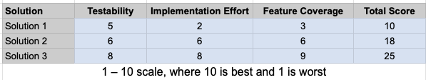

# BGO Financial

## Contributions
- [**Aaron Borja 200482770**](https://github.com/creationNA)
- [**Yuval Glozman 200482531**](https://github.com/YuvalCodes)
- [**Zana Osman 200489300**](https://github.com/Kurdonthego1)

## Table of Contents

1) [**Introduction**](#1-introduction)
2) [**Design Problem**](#2-design-problem)
    * 2.1) Problem Definition
    * 2.2) Design Requirements
        * 2.2.1) Functions
        * 2.2.2) Objectives
        * 2.2.3) Constraints
3) [**Solution**](#3-solution)
    * 3.1) First Solution
    * 3.2) Second Solution
    * 3.3) Final Solution
        * 3.3.1) Components
        * 3.3.2) Features
        * 3.3.3) Environmental, Societal, Safety, and Economic Considerations
        * 3.3.4) Limitations
4) [**Teamwork**](#4-team-work)

## 1) Introduction

* This project is a console-based bank management application developed in Java, which is designed to primarily explore and integrate software testing methods. Although the major focus of this project is to implement testing techniques, this application will still consist of the basic core features such as account creation and ability to deposit and withdraw.

## 2) Design Problem

### 2.1 Problem Definition

* With the ever changing economic landscape, the safe and reliable management of your wealth has never been harder. Without a solution that allows users to manage their wealth and keep it secure, it puts stress and worry on them. This can lead to financial instability, unexpected debt, and difficulty achieving long-term financial goals. Our system will allow users to safely store, deposit, and withdraw and review their financial resources in an easy and reliable menu without too much complexity. 

### 2.2 Design Requirements

### 2.2.1 Functions

* Create new bank accounts with unique identifiers
* Deposit funds into user accounts
* Withdraw funds from user accounts
* Display account balances

### 2.2.2 Objectives

* App reliability
* Implementing local storage 
* User friendly with easy directions
* Easily testable and has no bugs

### 2.2.3 Contraints

* Budget constraints
* Team size
* Time constraints, project needs to be completed in 7 weeks
* Hardware and Software constraints
* Program must be created in Java, using Junit to test
* Testing using the V-Model

## 3) Solution

### 3.1 Solution 1
For our first solution, our idea was to stray towards making a GUI for our application using basic HTML, CSS and Javascript and or other Java frontend frameworks, while also focusing on implementing the main functionalities of our appplication. This includes:
* Ability to create different types of accounts.
* Depositing funds into accounts.
* Withdrawing funds from made accounts.
* Displaying account balances. 
* Abillity to delete own account.

With this solution, we would implement any of the big name databases such as MongoDB, or MySQL. When it comes to selecting a testing framework for this solution, we wanted to keep it minimal and stick with JUNit.

After considering all of these features in our application, we found that this solution would make testing and development more complex and serverly increase our development time, given our team only has a month to code and develop the main functionalities of our application. 

This solution would be prioritized over other alternatives if development time was not a primary constraint.

### 3.2 Solution 2
Our second solution would have the main functionalities of our first solution. However, this time instead of utilizing front-end languages/frameworks like HTML, CSS and Javascript for example, we would strictly limit our application to run using a console/terminal based GUI. This solution would give us more time to focus on testing and functionality of the program rather than it's visual appeal or ease of use when it comes to the grapical interface.

### 3.3 Final Solution

For our final solution, we ended up leaning towards Solution 2 as an inspiration, which is a CLI-based architecture with key features like deposit/withdraw, and transfer funds feature. This allowed us to maximize the testability in our project, while also being able to deliver reliable business logic within the short timeframe we were given. With this solution, we were able to reduce the dependency on the front-end frameworks, which allowed us to spend more time with the needed code paths and maintaining the components in the codebase. We used SQLite which allowed us to store data directly in a single, self-contained file on the local file system. This eliminatred the need of a server which made the application easier to work with and test.

#### Solution Table

#### Application Components

### 3.3.1 Components

Our solution was broken into 4 primary files, bankUser.java, bankAccont.java, bank.java, & cli.java

* bankUser.java: simple getter and setter functions to access any bankUser objects.
    * Testing method: Not tested directly, just setters and getters

* bankAccount.java: simple getter and setter functions to access any bankAccount objects.
    * Testing method: Not tested directly, just setters and getters

* Bank.java: Our primary function file, holding all of our bank functions including, userLogin, addAccount, deleteAccount, depositToAcc, withdrawFromAcc, and transferFunds, getAccount.
    * Testing Method: Tested functions mentioned below

* cli.java: Component that controls the user-interface through a CLI.
    * Testing Method: Use Case Testing, State Diagram

**Functions**

* userLogin: Login function that checks against the Database a username and password and returns true/false to authenticate the user.
    * Testing Methods: Use Case Testing, State Diagram, Decision-Based Testing

* addAccount: Allows a user to add a “savings” or “chequing” account that doesn’t exist yet. Returns true or false based on the result.
    * Testing Methods: Use Case Testing, State Diagram, Decision-Based Testing 

* deleteAccount:  Allows a user to delete an existing “savings” or “chequing” account. Returns true or false based on the result
    * Testing Methods: Use Case Testing, State Diagram

* depositToAcc: Allows a user to deposit a value from 1 to 10,000 into an existing account, returns true or false based on the success of the operation.
    * Testing Methods: Boundary Value Assessment, Equivalence Class Based Testing, State Diagram

* withdrawFromAcc: Allows a user to withdraw a value from 0 to 5,000 from an existing account, returns true or false based on the success of the operation.
    * Testing Methods: Boundary Value Assessment, Equivalence Class Based Testing, Path Testing, Use Case Testing, State Diagram

* transferFunds: Allows a user to transfer funds between two existing accounts, from 0 to 7,500. Returns true or false based on the success of the operation.
    * Testing Methods: Boundary Value Assessment, Equivalence Class Based Testing, Use Case Testing, State Diagram

* getAccount: Retrieves an account based on a username and accountName. Primarily used as a helper function in other functions. Returns null or bankAccount object depending on the success of the operation.
    * Testing Methods: Decision-Based Testing

### 3.3.2 Environmental, Societal, Safety, and Economic Considerations
* Our CLI‑based design makes deliberate trade‑offs to minimize resource usage, maximize accessibility, and keep costs low, while ensuring reliability and user safety:
* Environmental
    * A text‑only interface uses virtually no graphics, GPU, or heavy CPU cycles, reducing energy consumption on both desktops and servers.
    * Zero dependencies on large frameworks or libraries further shrinks the application’s footprint and lowers its carbon impact over time
* Societal
    * Command‑line interfaces work equally well on low‑power devices, remote terminals, and screen readers, ensuring broad accessibility for users with limited hardware or visual impairments.
    * No reliance on high‑bandwidth connections or modern browsers makes the app viable in under‑served or developing regions.
    * This application will help provide users a way to track balances within their accounts and allow them to make better purchasing decision and budget more effectively
* Safety & Reliability
    * Strong input validation prevents invalid menu selections and malformed data, guarding against crashes and data corruption.
    * Automated unit and integration tests exercise every code path (login, account ops, transfers), so regressions are caught before release.
    * Our application also utilizes a local database to ensure security and reliability by being readily available at any time needed
* Economic
    * The way we designed our application made it so we didn’t need a  dedicated database server VM or containers which reduces hardware and personnel cost.
    * Agile development practices (short sprints, continuous integration) kept team overhead low and accelerated delivery.

### 3.3.3 Test Cases and results
* We used Boundary Value Analysis (BankTestBVA,java), Decision-Based (BankTestDT.java), Data Flow (BankTestDF.java), Path Testing (BankTestPF.java), Equivalence Based testing (BankTestEQV.java), State Diagram and Use-Case testing for us to cover every part of our application.
* This allowed us to have a better understanding of the application and provide the user with no empty routes having tested every possible case.
* We executed the tests by automating tests as well as manually creating tables, flow charts and end to end testing through our application using the CLI.

### 3.3.4 Limitations
* One limitation we have with this project is implementing a CLI instead of a web based application using front end languages/frameworks. The main focus of this project was to indulge in the testing environment, so as a group we ultimately decided on distributing our effort more on the testing side instead of dedicating a frontend to support our application. 
* Another limitation with this project is security. We decided to take the route of using pre-defined credentials when using our applications. This means that users will not be able to sign-up using their own credentials. While this helped us center our attention with testing, it gave us the limitation of not having factors such as password security and privacy. The credentials are stored in the SQLite file with no hashing or encrypting which is a major limitation in our app. 
* As of now, our application is also very limited in flexibility. This application only supports basic chequing/saving account creation and fixed deposit/withdraw/transfer features, which is lacking when compared to more advanced bank management applications.

## 4) Team Work

### 4.1 Meeting 1

* Time: May 14th, 2025 
* Hour: 6:18pm to 7:02pm
* Agenda: Selecting a project and development of “Problem Definition”
*   | Team Member | Previous Task | Completion State |
    |----------|----------|----------|
    | Aaron Borja | N/A | 100% |
    | Yuval Glozman | N/A | 100% | 
    | Zana Osman | N/A | 100% | 

### 4.2 Meeting 2

* Time: May 21st, 2025 
* Hour: 7:35pm to 8:15pm
* Agenda: Creating our design requirements and constraints
*   | Team Member | Previous Task | Completion State |
    |----------|----------|----------|
    | Aaron Borja | N/A | 100% |
    | Yuval Glozman | N/A | 100% | 
    | Zana Osman | N/A | 100% | 

### 4.3 Meeting 3

* Time: June 4th, 2025 
* Hour: 10:00pm to 10:45pm
* Agenda: Developing two design solutions for our application
*   | Team Member | Previous Task | Completion State |
    |----------|----------|----------|
    | Aaron Borja | N/A | 100% |
    | Yuval Glozman | N/A | 100% | 
    | Zana Osman | N/A | 100% | 

### 4.4 Meeting 4

* Time: June 7th, 2025 
* Hour: 10:30am to 2:30pm
* Agenda: Started developing application, implemented TDD and wrote tests for login and signup.
*   | Team Member | Previous Task | Completion State |
    |----------|----------|----------|
    | Aaron Borja | N/A | 100% |
    | Yuval Glozman | N/A | 100% | 
    | Zana Osman | N/A | 100% | 

### 4.5 Meeting 5

* Time: June 7th, 2025 
* Hour: 10:30am to 2:30pm
* Agenda: Started developing application, implemented TDD and wrote tests for login and signup.
*   | Team Member | Previous Task | Completion State |
    |----------|----------|----------|
    | Aaron Borja | N/A | 100% |
    | Yuval Glozman | N/A | 100% | 
    | Zana Osman | N/A | 100% | 

## 5) 

## 6) Conclusion and Final Work

Upon completing this project, we successfully implemented, designed and tested a CLI based banking management application that focused on practicing and enhancing our knowledge about the wide range of software testing methodologies and strategies we learned throughout this semester. By integrating our third solution as the final design, our team would work with a project that seamlessly achieves our objectives of having a local storage, a simple and user-friendly interface, and an application that would be easily testable. The system supports the basic, but essential banking operations such as account creation, being able to deposit and withdraw, checking account balances, and allowing users to transfer their funds to different accounts. 

When it comes to testing, our team applied numerous testing strategies and methodologies. Path testing was used on the withdraw function to ensure we covered full logical flow while data flow testing was used to verify that the variables used in our functions were consistent. Integration testing was also implemented to test the flow between the important components in our program. Additionally, use-case testing tables and state diagrams were created to test user workflows and real-world interactions. Lastly, strategies Boundary Value Testing, Equivalence Class Testing, and Decision Tables were implemented to evaluate inputs and their different conditions. By using these strategies, this allowed us to obtain reasonable code coverage within the different modules. 

Although we had many successes developing this project, we are also aware of the different limitations this project presents itself with. A big future design improvement that we could work on is scrapping the CLI and transitioning over to a proper front-end interface using frontend languages and tools. This would make the project stand out more and be more approachable for users. Testing was the main priority in this project, so aspects that we thought were advanced for the scope of this project such as user signup functionality, password hashing, and more complex banking features were omitted from the final design. By refining our system and using these design improvements, we believe this project has potential to become a powerful finance management tool.

## 7) 

Gesh: Yo