This provides a brief overview of the testing methods and strategies we used to validate the functionality of our project. Techniques such as Path Testing, Data Flow Testing, Boundary Value Analysis, Equivalence Class Testing, Decision-Based Testing, State Transition Testing, and Integration Testing

### Testing Techniques:
- Path Testing
- Data Flow Testing
- Boundary Value Analysis
- Equivalence Class Testing
- Decision-Based Testing
- State Transition Testing
- Integration Testing
***

### Path Testing
* 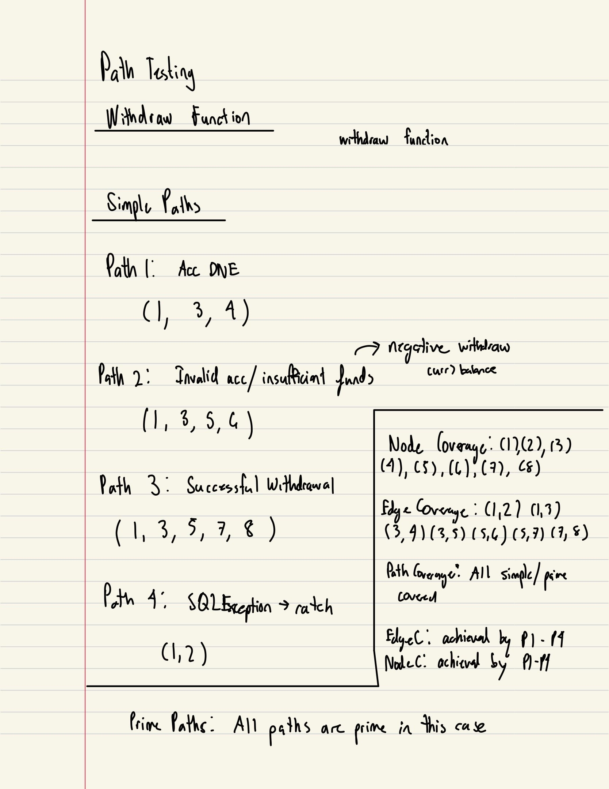
* 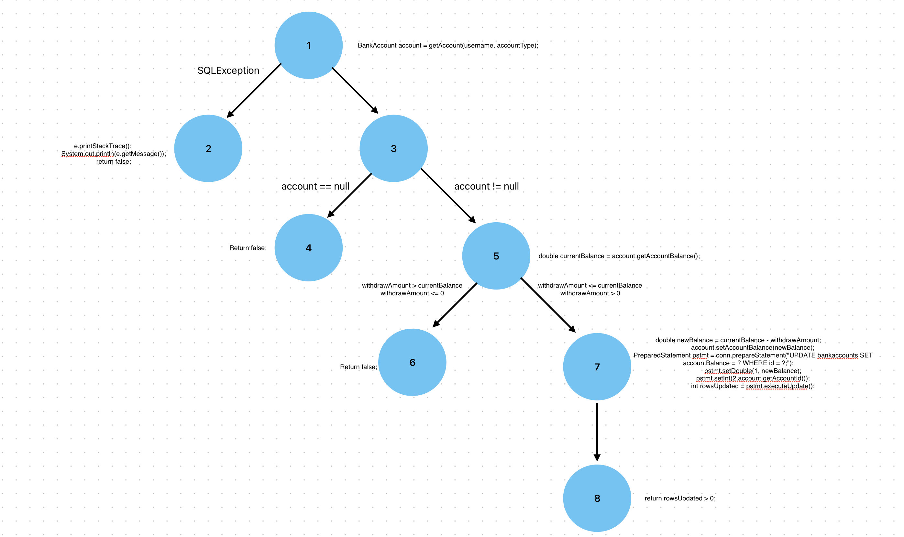
When choosing a function to implement path testing, we decided it would be best to use our withdrawal function. We made sure all possible routes were evaluated, whether that be successful or unsuccessful paths. 

### Data Flow Testing
For the data flow testing we decided to utilize in on our addAccount function in Bank.java

In the document below it shows a step by step case of the development of the test cases for the function, from creating the graph of the function, to the DU paths and the test case parameters that will cover them.

[Data Flow PDF](Documents/DF3752.pdf)

### Boundary Value Analysis & Equivalance Class Testing

For both of these testing methods, we chose to only use them on functions in our app that taken in a numeral value as one of the arguments, since most of our functions only take two strings, those functions wouldn't benefit as much from these two testing methods.00pm

The functions that we did use these testing methods are,

1. depositIntoAcc(String username, String accountName, double amount)
2. withdrawFromAcc(String username, String accountType, double withdrawAmount)
3. transferFunds(String username, String fromAccountType, String toAccountType, double amount)

The detailed documentation as to how the test cases were formed for each of these functions is documented in the file below

[BVA & EQV](Documents/BoundaryValueTesting&EquivalanceClassTesting.pdf)

### Use Case Testing
* 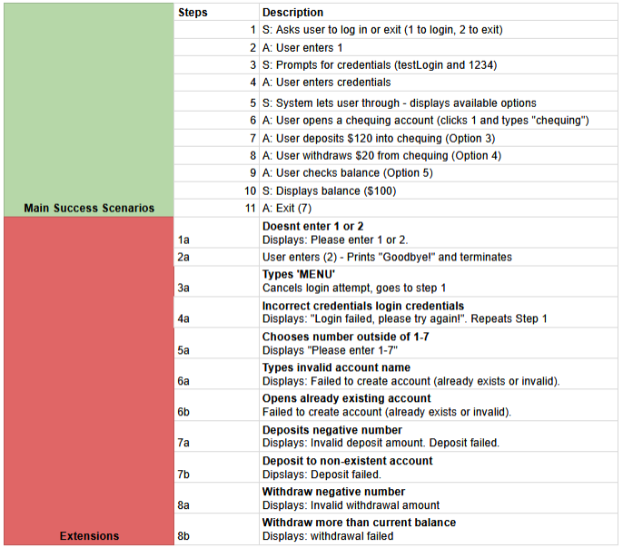

* 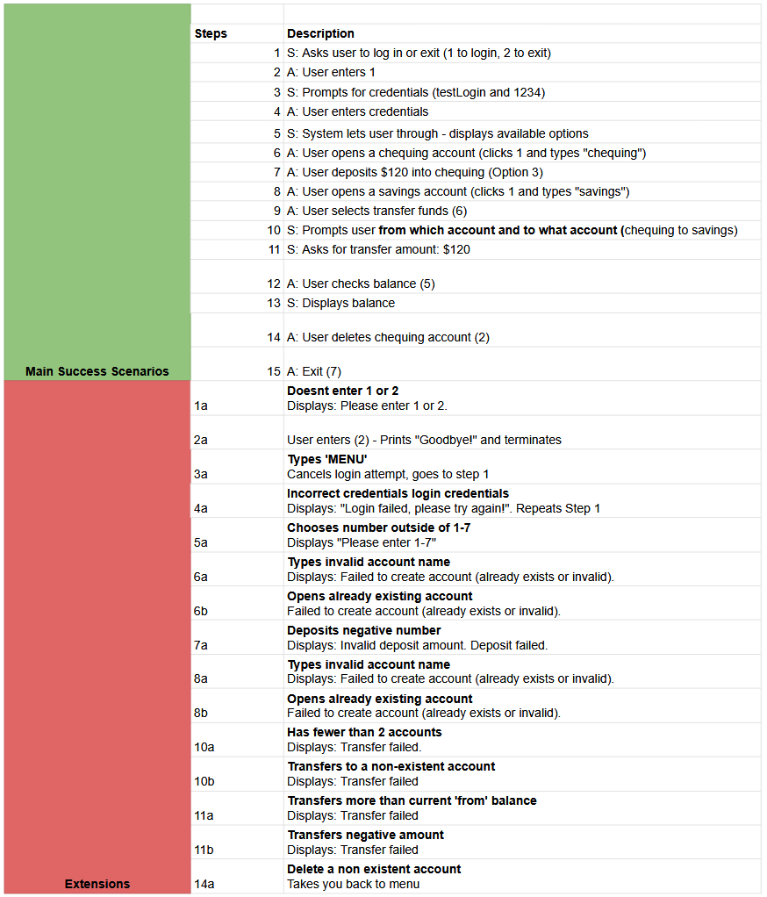

As seen above, we explored and simulated two main flows the user could potentially go through with our application. This included success paths and exception conditions. The goal of this testing strategy was to validate that the operations worked in sequence, and that error handling would work as intended and provide user with feedback.

### Decision Based Testing

For our Decision Based Testing we started off by taking all of our functions that we had and counted how many parameters each functions needed

From this we then took the amount of paramaters to genereate our Conditions and Actions and get the amount of rules needed with 2^conditions

Each of our functions were then tested using the rules we had found in order to ensure we had exhausted all cases from our code

Our functions included:

* addAccount Testing

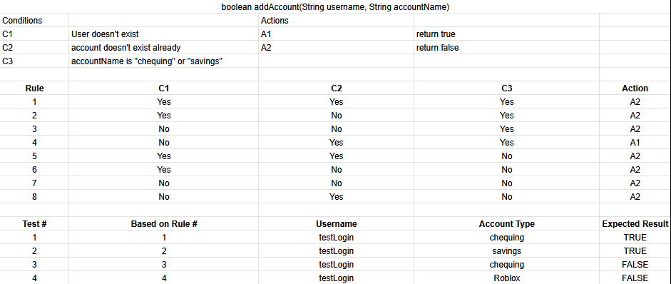

* checkAccountBalances Testing

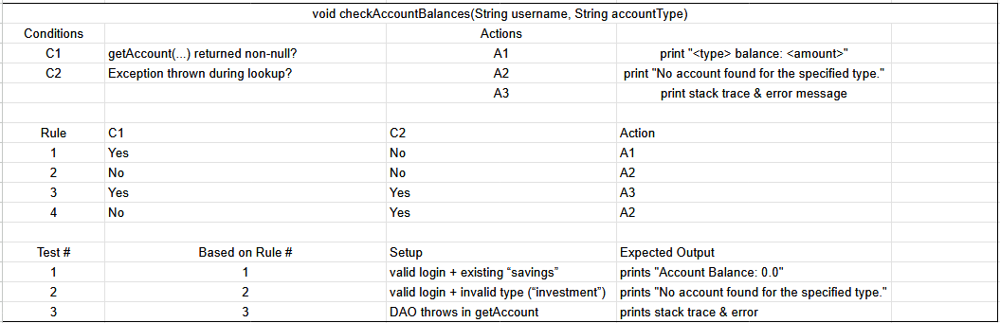

* deleteAccount Testing

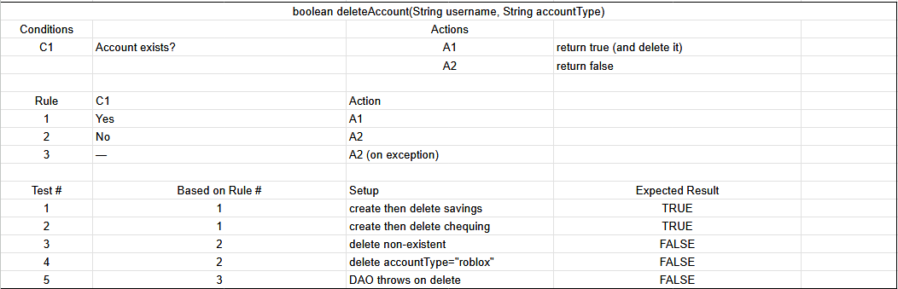

* depositToAcc Testing

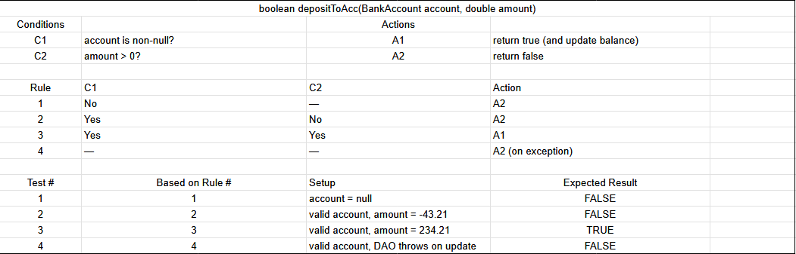

* getAccount Testing

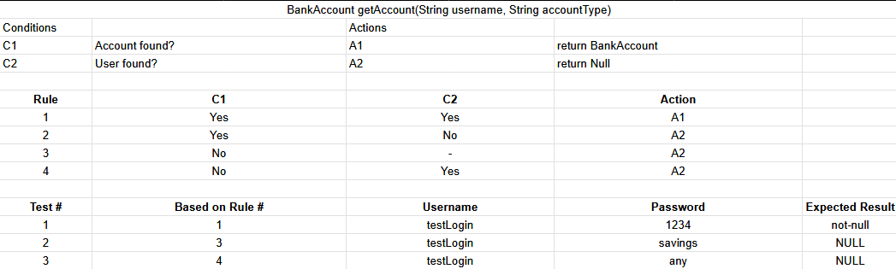

* transferFunds Testing

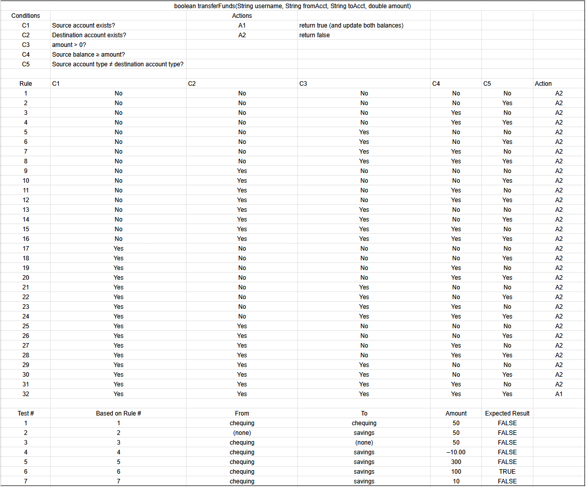

* userlogin Testing

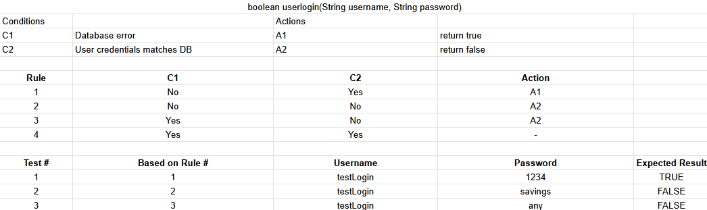

* withdrawFromAcc Testing

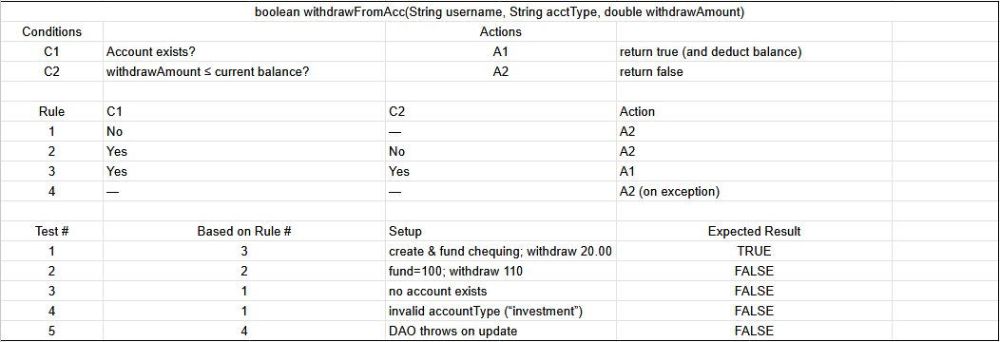